# EDI-Cat README

AN EDIFACT/X12 file viewer, formatter.

## Install
It can be installed for as an extension for vscode
under Windows or MacOS

make sure VS code version >= 1.83

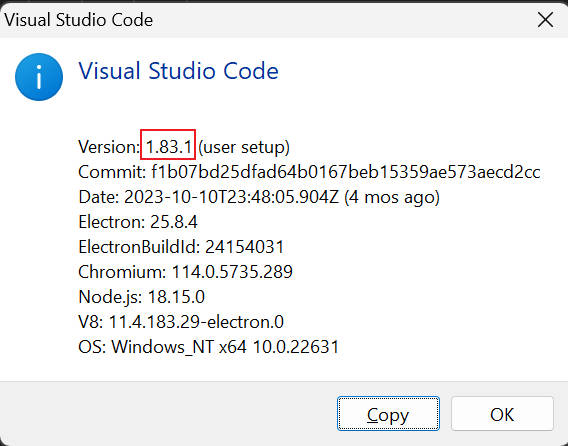

then go to extensions menu, use "...->Install from VSIX" menu, then select the downloaded VSIX to install
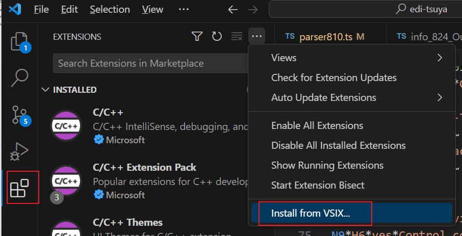

## Features

##### Assistant Explorer. 
When you open .x12/.edi/.edifact file, it will give you assistant correspondingly. Then you can use "+" to add sample code to you file.

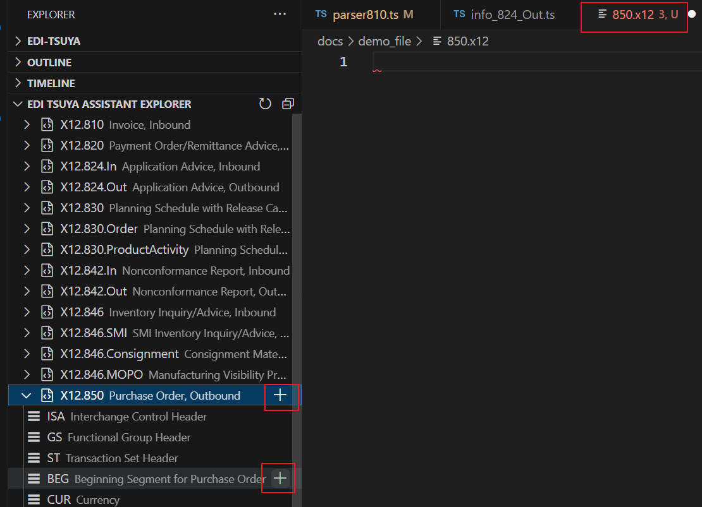

##### Hover for detail
Mouse hover to some fields like Currency, Country, UoM, Timezone, it will show you the detail meaning of the value.

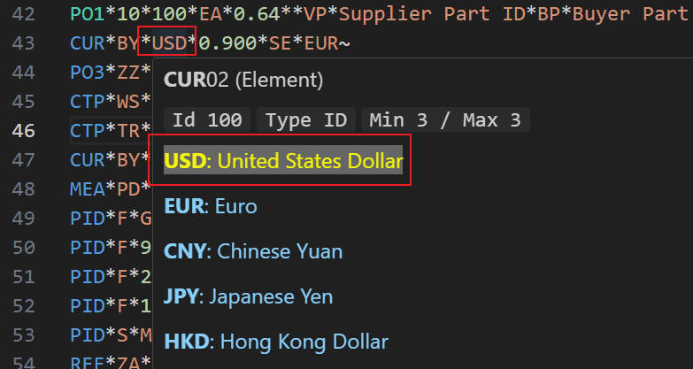

Some fields need a list to explore, you can click the the link for details

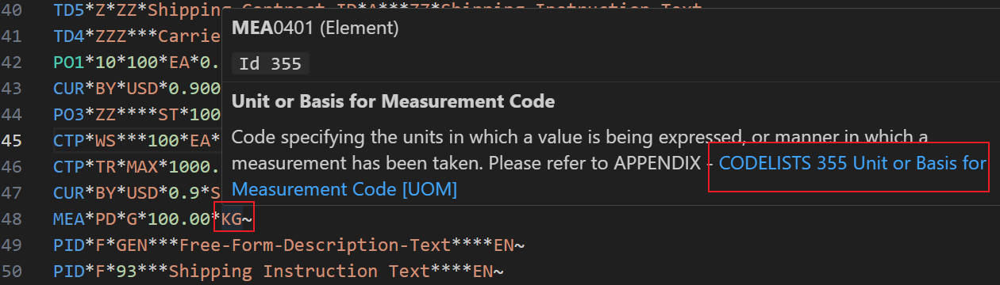

##### Codelists
Use menu "view->Command Palette..." and search for "Open Code List",

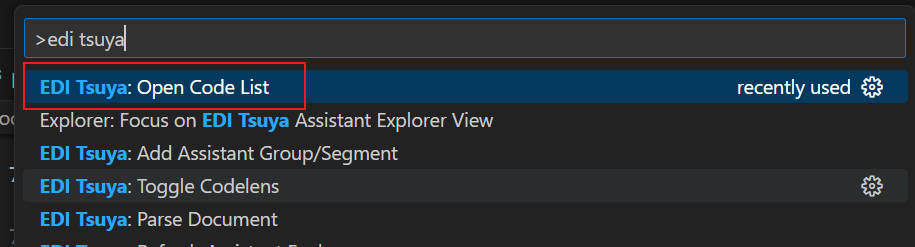

after executing this command, you have option to select the code list you want to view

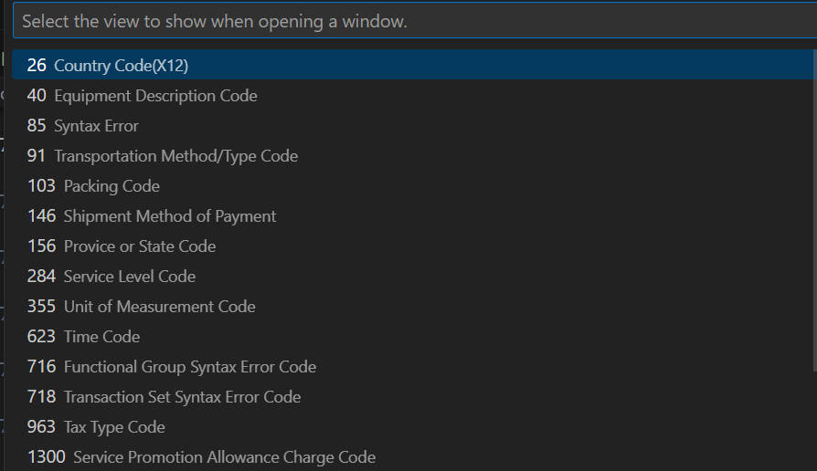

Code List display:

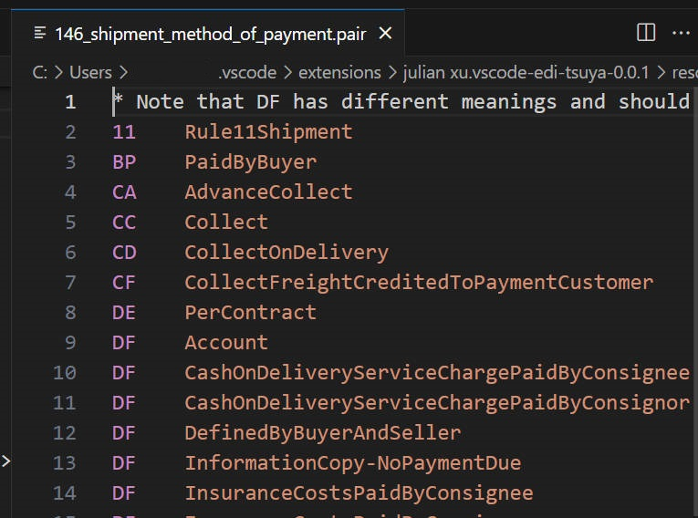

##### Syntax Check
Before letting extension to do Syntax Check, you need to specify document version before that, because it cannot determine some version like 850, 856 automatically.
The menu is on the bottom-left, a yellow label.

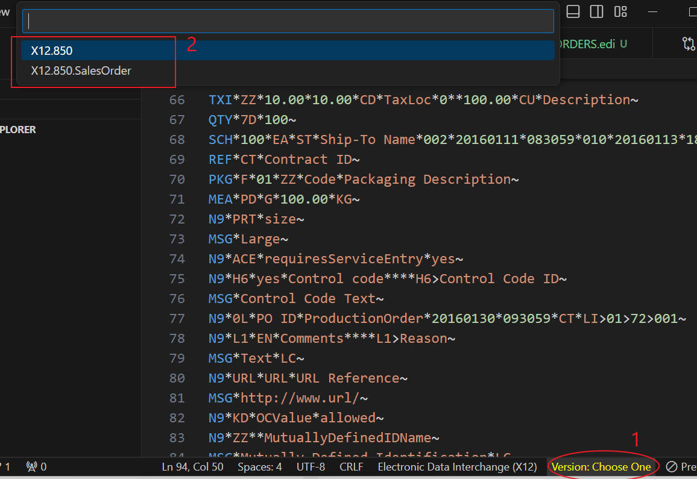

It can do Control  Number check

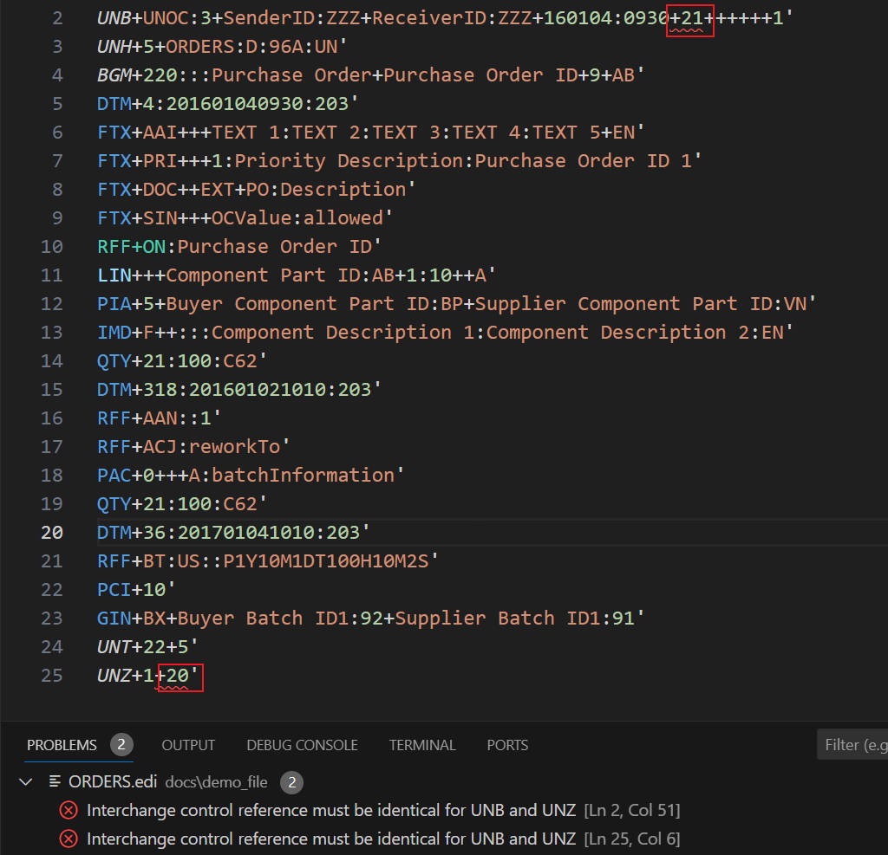

Or Syntax Check, below is example when QTY segment is deliberately put under DTM segment, which caused an error.

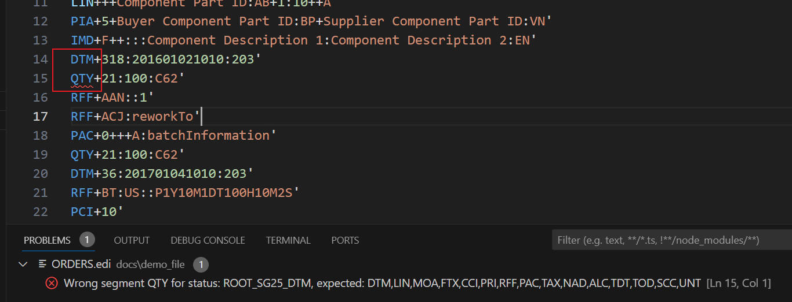

##### Codelens
Make sure document version correctly selected and there is no syntax error.
Use menu "view->Command Palette..." and search for "Toggle Codelens"

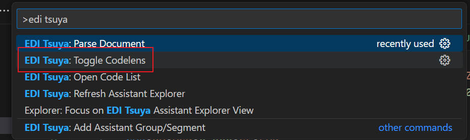

after executing this command, the group of every segment is shown in Codelens.
No group means it's under ROOT group.

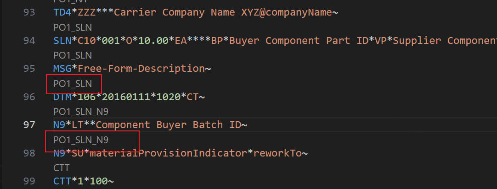

##### Parse Document
Make sure document version correctly selected and there is no syntax error.
Use menu "view->Command Palette..." and search for "Parse Document".

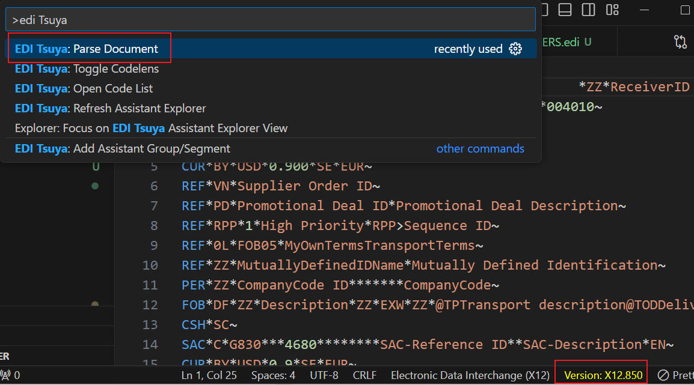

after executing this command, the structure of the file displays. 
You can hover to see details, but please don't edit in this window.

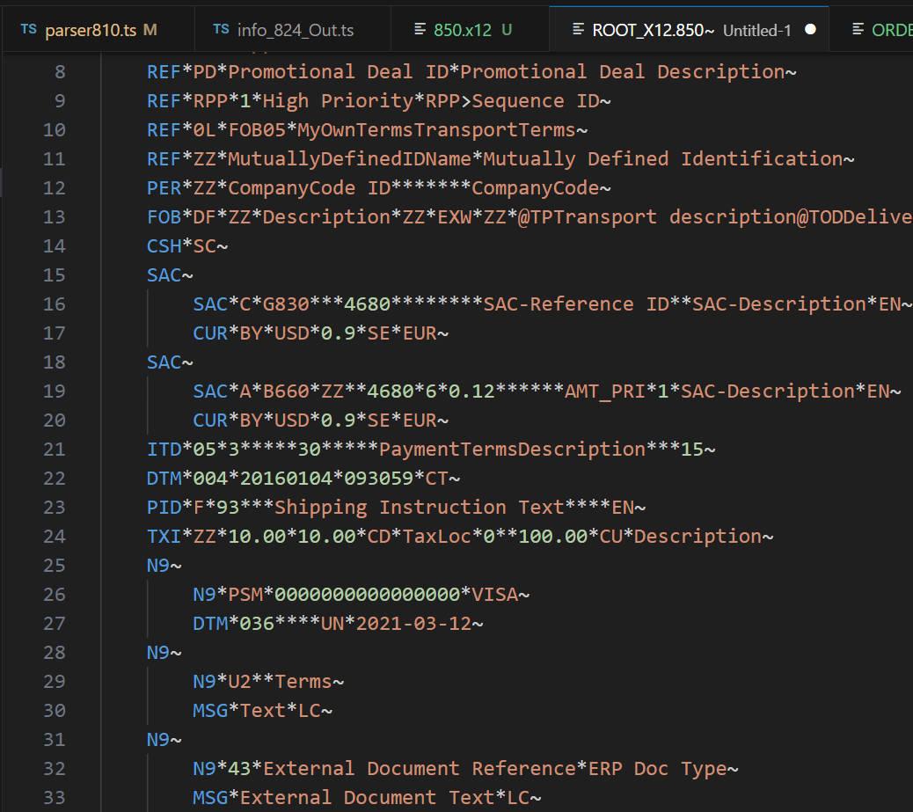

## Requirements

Make sure the file extension is x12,edi or edifact

## Known Issues

Need your feedback. Welcome Bug Report and Enhancement Request.

## Future
Trying to add functionality to convert to cXML or vice versa

## Release Notes

It's Alpha version.

### 1.0.0

---

**Enjoy!**
