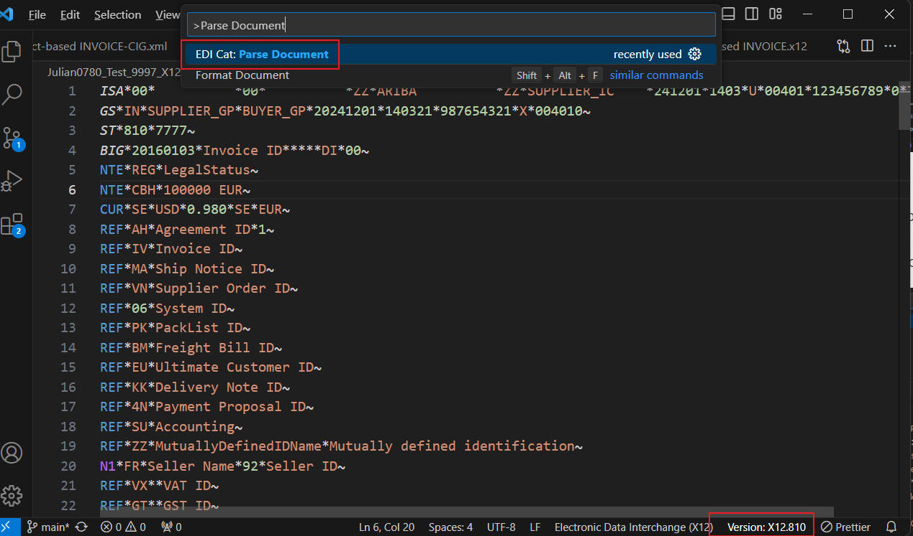
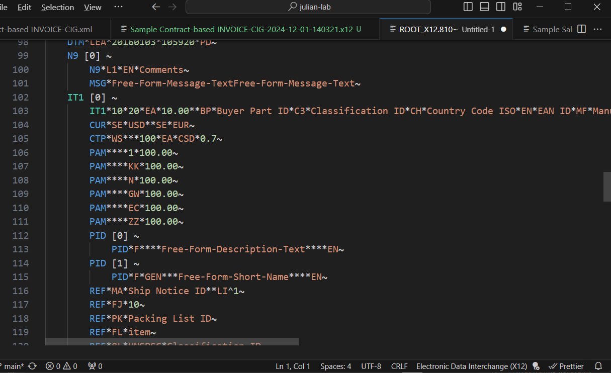
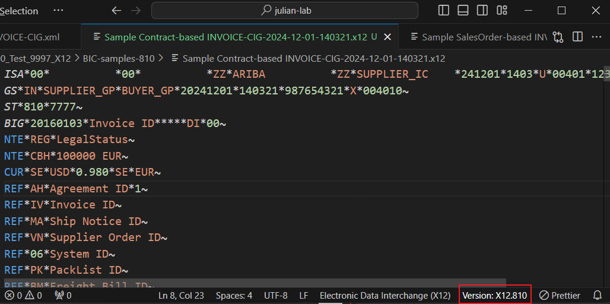
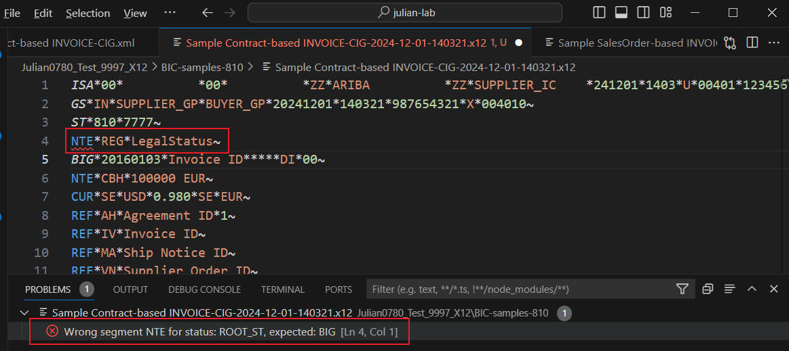
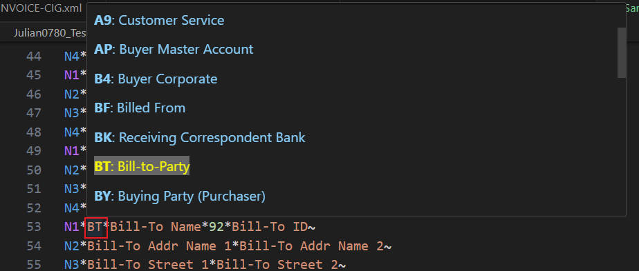
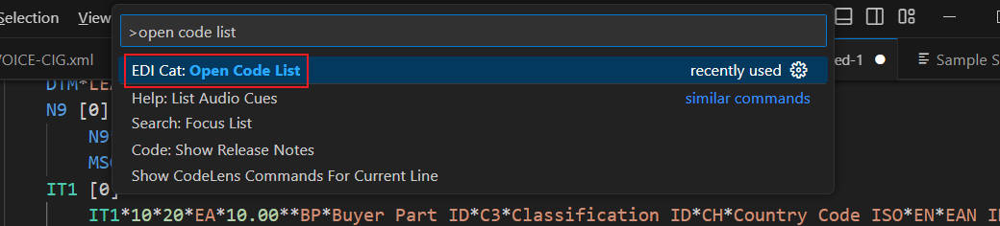
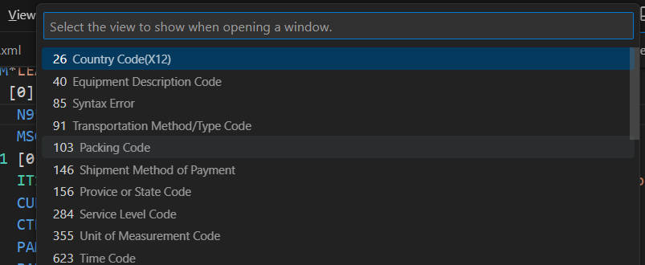
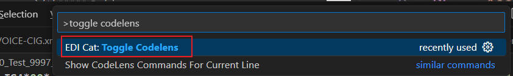
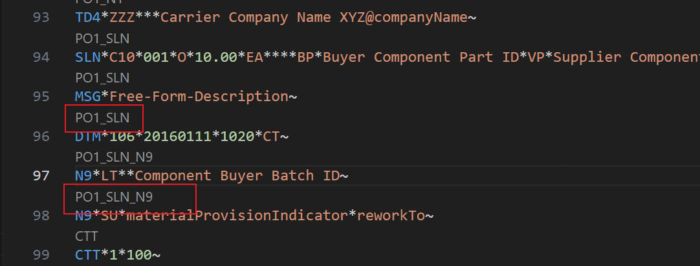

# EDI-Cat README

AN EDIFACT/X12 file viewer, formatter, converter.

## Install
It's a VSCode Extension, search this extension and install it.

## Features

##### Convert from cXML to X12 or EDIFACT D96A
1) Open a cXML (OrderConfirmation, ASN, Invoice)
2) Make sure there is no xml syntax and DTD validation error.
  (Recommend you to install other extension to check XML)
3) Use menu "View->Command Palette", then find command "EDI Cat: Convert to ..."
4) Then use menu cXML_to_X12 or cXML_to_EDIFACT_D96A

##### Parse Document
Make sure document version correctly recognized and
there is no validation error.
Use menu "View->Command Palette..." and search for "Parse Document".

after executing this command, the structure of the file displays. 
You still can hover to key element to see details.

##### Syntax Check
Extension can detect file version automatically and display it on right-bottom of window.
Usually the color is normal white, but if it's yellow, it means user need to click there to help it decide the version.

It can do Control  Number check

Or Syntax Check, below is example when NTE segment is deliberately put before BIG segment, which caused an error.

##### Format Document
For .xml or .x12 .edi .edifact File, right click on the content,
There is a context menu "Format Document" to help you format this document.

##### Hover for detail
Mouse hover to some fields like Currency, Country, UoM, Timezone, it will show you the detail meaning of the value.

Some fields need a list to explore, you can click the link for details

##### Codelists
Use menu "View->Command Palette..." and search for "Open Code List",

after executing this command, you have option to select the code list you want to view

Code List display:

##### Codelens
Make sure document version correctly selected and there is no syntax error.
Use menu "View->Command Palette..." and search for "Toggle Codelens".

after executing this command, the group of every segment is shown in Codelens.
No group means it's under ROOT group.

If you feel it's disturbing, re-run this command to disable Codelens.

## Requirements

Make sure the file extension is .x12, .edi or .edifact.
For .txt, it will detect the file type and apply corresponding syntax color.

## Known Issues

1) Delimiters like '~', '*', '+', '>' is hard-coded to recognize x12 and EDIFACT structure.
Please make sure you are using delimiters shown in screenshots of this README.

2) The purpose of this product is to reduce workload on creating Supplier side EDI documents. So it may lack of functions for Buyer to use.

3) This extension use '-' as delimiter for splitting numbers(Country, District) inside Telephone/Fax number, so the result may not be expected.
Manually fix it if you find this part of result is weird.

4) When there is '?' acting as escape-char in EDIFACT, related syntax highlight may appear strange.
This will not affect other functions.

5) When converting cXML -> x12, the package info of [PackagingLevelCode = 0003] is not included.
Let me know the real business case and I will try to add the conversion.

6) For X12 810 Extrinsic, taxFormCode, agencyLocationCode, customerReferenceNo, taxExchangeCode, 
clientNumber, accountNumber HAVE THEIR OWN quaulfier so WILL NOT be converted to REF*ZZ. 
Let me know if you want to change the behavior.

7) EDIFACT DESADV conversion, need to manually adjust for cXML XPath 'Packaging/PackageID/GlobalIndividualAssetID'

8) EDIFACT DESADV PACKAGING conversion, the generated EDI will contain RFF+ON info under LIN segement when there are multiple related POs, which is correct. But somtimes you cannot get expected cXML when converting it back to cXML using other software. You need to consult THIS software's support.

9) X12 856, 'Packaging/ShippingMark' is out of scope.

10) Timezone 'IST' may not work in both X12 and EDIFACT

## Future
Add more formats and more conversion functions

---

**Enjoy!**
Help rate it in Extension MarketPlace so more people can enjoy it.
Thanks.